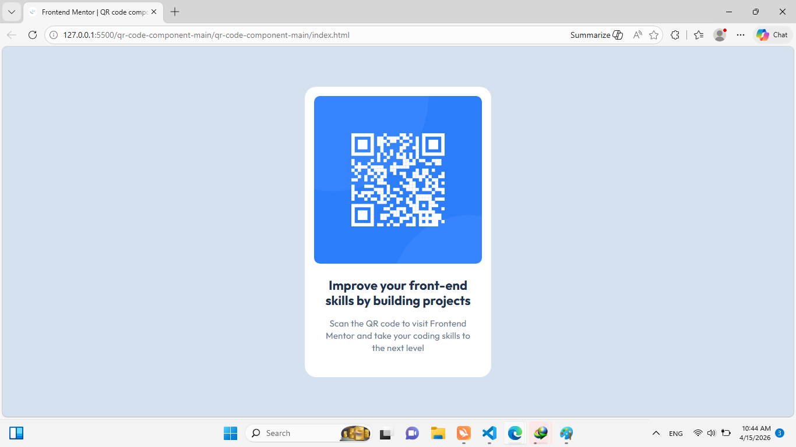
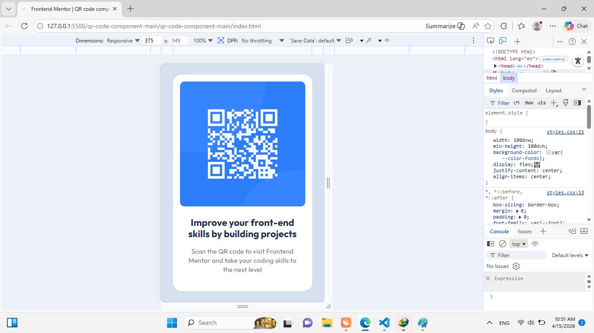

# Frontend Mentor - QR code component solution

This is a solution to the [QR code component challenge on Frontend Mentor](https://www.frontendmentor.io/challenges/qr-code-component-iux_sIO_H). Frontend Mentor challenges help you improve your coding skills by building realistic projects.

## Table of contents

- [Overview](#overview)
  - [Screenshot](#screenshot)
  - [Links](#links)
- [My process](#my-process)
  - [Built with](#built-with)
  - [Continued development](#continued-development)
  - [Useful resources](#useful-resources)
- [Author](#author)

## Overview

### Screenshot




### Links

- Solution URL: https://github.com/Thaliapt27/QR.git
- Live Site URL: https://thaliapt27.github.io/QR/

## My process

### Built with

- Semantic HTML5 markup
- CSS custom properties
- Flexbox

### What I learned

In this project, I reinforced the importance of aligning designs precisely (**Pixel Perfect**) using tools like PerfectPixel.

Example of how I centered the content:

```css
body {
  display: flex;
  justify-content: center;
  align-items: center;
  min-height: 100dvh;
}
```

### Useful resources

-PerfectPixel: This extension helped me compare my code with the Figma design to achieve total accuracy.

## Author

- Frontend Mentor - [@Thaliapt27](https://www.frontendmentor.io/profile/Thaliapt27)
- Github - [@Thaliapt27](https://github.com/Thaliapt27)
